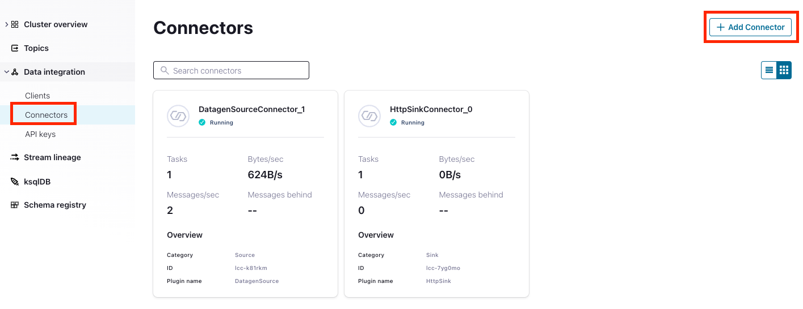
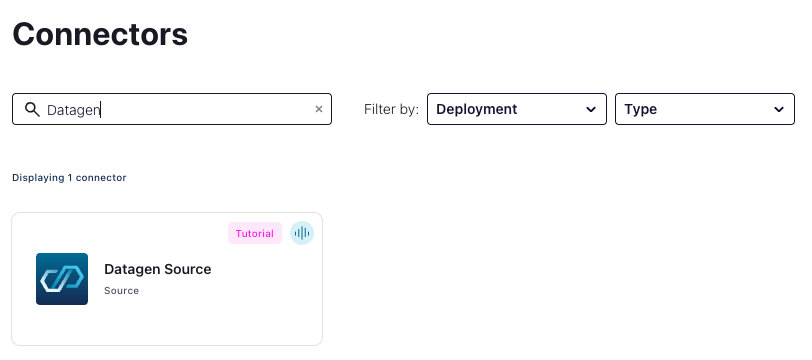
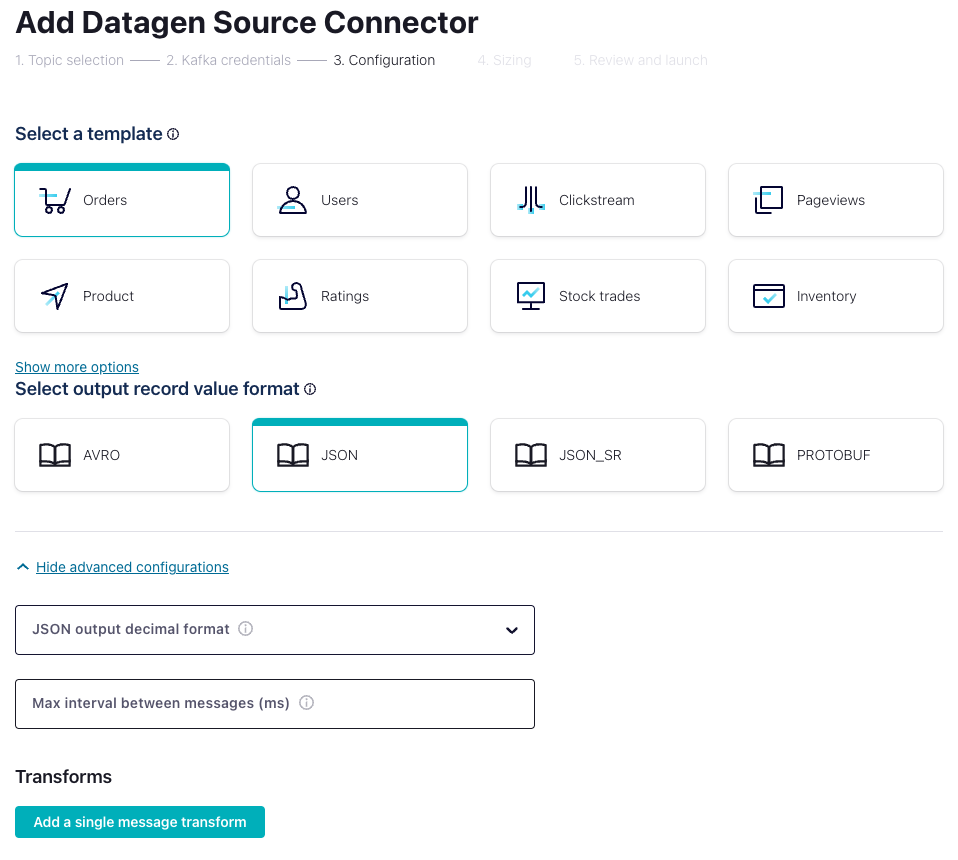

# Confluent Cloud Workshop (日本語)
Confluent Web UIとCLIを利用してConfluent Cloudを利用するワークショップです。CLIの基本的な使い方やConnector、ksqlDBによる処理の幾つかを実際に触れることが出来ます。
## 事前準備
- Confluent Cloudでのユーザー登録 (https://confluent.cloud/signup)

## Confluent CLI
### インストール: 
https://docs.confluent.io/confluent-cli/current/install.html#install-confluent-cli
### ログイン
```bash
confluent login --save
```
### envの確認
```bash
confluent env list
```
### envの作成
```bash
confluent env create hashi-demo -o json
```
### 作成したenvを利用
```bash
confluent env use env-xxxxxx
```
### Clusterの作成
```bash
# Cluster生成時のパラメータを確認
confluent kafka cluster create
# Clusterの作成（AWS, Tokyo, Basic, Single AZ)
confluent kafka cluster create hashi-demo-default --cloud aws --region ap-northeast-1
```
### 作成したClusterを利用
```bash
confluent kafka cluster use lkc-xxxxx
```

## DageGen Connector (WEB UI)
Confluent Cloudでは多数のConnectorをフルマネージドでご提供しており、UIから設定が可能です。`Connectors`メニューより新規に追加可能です。

DataGen Connectorはテストデータのストリームを自動生成する検証用Connectorです。このConnectorは外部からのProducerアクセスを擬似的に再現するConnectorで、指定されたTopicに対してランダムなテストイベントを送り続けます。

イベントの種類は複数の選択肢から選ぶ事が可能です。またSchemaのタイプ等の設定もUI上で出来ます。イベントはランダムに出力されますがSchema自体は固定です。イベントの構成を変更することはできません。


## DataGen Connector (CLI)
### 利用可能なConnectorのリスト
```bash
confluent connect plugin list
```
### DataGen Source Connectorの概要
```bash
confluent connect plugin describe DatagenSource
```
### 登録済みConnectorのリスト
```bash
confluent connect list
```
### Connect共通API Keyの作成
```bash
confluent api-key create --description "Common Key for Connectors" --resource lkc-0x21o5 -o json
```
### DataGen用Topicの作成
```bash
confluent kafka topic create datagen-source
```
### DataGen Connectorの作成
```bash
confluent connect create --config connect/datagen-config.json
```

## HTTP Sink Connector
### APIエンドポイントの確保
https://webhook.site
もしくは叩けるAPIがあれば何でも
### HTTPSink Connectorの概要
```bash
confluent connect plugin describe HttpSink
```
### HttpSink用Topicの作成
```bash
confluent kafka topic create http-sink
```
### HttpSink Connectorの作成
```bash
confluent connect create --config connect/httpsink-config.json
```

## ksqlDB
### 1st Pipeline - DIRECT
Source TopicをStreamとして定義
```sql
CREATE STREAM DataGen1 (
    transaction_id INT,
    card_id INT,
    user_id VARCHAR,
    purchase_id INT,
    store_id INT
) WITH (
KAFKA_TOPIC='datagen-source-1', VALUE_FORMAT='JSON');
```
Source StreamをそのままSinkのTopicに流し込むパイプラインを作成
```sql
CREATE STREAM DIRECT_PIPE
WITH (KAFKA_TOPIC='http-sink', VALUE_FORMAT='JSON')
AS SELECT
    transaction_id,
    card_id,
    user_id,
    purchase_id,
    store_id
FROM DataGen1
EMIT CHANGES;
```
データの流れをStream Lineageで確認後、削除します。

Source StreamをそのままSinkのTopicに流し込むパイプラインを作成
```sql
CREATE TABLE AGGREGATED_PIPE
WITH (KAFKA_TOPIC='http-sink', VALUE_FORMAT='JSON')
AS SELECT
    STORE_ID AS STORE_ID,
    COUNT(*) AS TOTAL
FROM DataGen1
WINDOW TUMBLING (SIZE 1 minute)
GROUP BY STORE_ID
EMIT CHANGES;
```
データの流れをStream Lineageで確認後、削除します。

